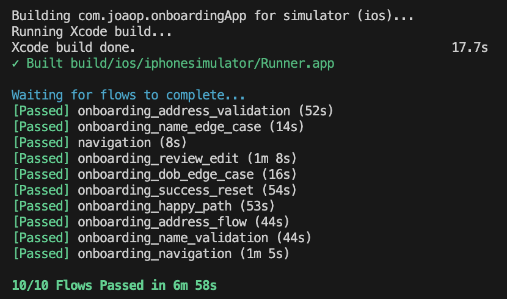
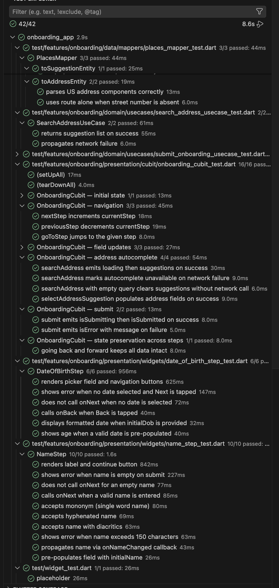

# Onboarding App

A Flutter onboarding flow that collects user profile data across 4 steps before submitting.

## Features

- **Step 1 — Full legal name**: Unicode-aware validation (mononyms, diacritics, hyphenated names)
- **Step 2 — Date of birth**: Material date picker with age validation (18–120 years)
- **Step 3 — Residential address**: Google Places Autocomplete with manual entry fallback
- **Step 4 — Review**: All data displayed for confirmation before submission

## Demo

Happy path demo recorded with Maestro:


## Getting Started

### Requirements

- Flutter 3.x (managed via [fvm](https://fvm.app))
- iOS simulator or Android emulator

### Setup

```bash
fvm flutter pub get
```

Create a `.env` file at the project root:

```
GOOGLE_PLACES_API_KEY=your_key_here
```

### Run

```bash
fvm flutter run
```

### Tests

Unit and widget tests:

```bash
fvm flutter test --coverage
```

Maestro UI tests (requires a running simulator):

```bash
maestro test --device <SIMULATOR_UDID> maestro/flows
```

You can also run Maestro tasks from VSCode with `Cmd+Shift+B`, for example:

- **maestro: run all flows** — runs all flows
- **maestro: run onboarding happy path** — runs only the happy path

See [maestro/README.md](maestro/README.md) for full Maestro setup and usage.

## Architecture

Clean Architecture with BLoC (Cubit):

```
lib/
├── app/              # App entry point and routing
├── core/             # DI, network, storage, theme, utilities
└── features/
    ├── onboarding/
    │   ├── data/     # Models, mappers, repositories, datasources
    │   ├── domain/   # Entities, use cases, repository contracts
    │   └── presentation/  # Cubit, pages, widgets
    ├── splash/
    └── success/
```

State is managed via a single `OnboardingCubit` (one `@freezed` data class, `copyWith` updates).  
API keys are loaded from `.env` via `flutter_dotenv` — never via `--dart-define` or hardcoded.

## VSCode Tasks

Common tasks are available via **Terminal → Run Task**:

| Task                        | Description                               |
| --------------------------- | ----------------------------------------- |
| `fvm: flutter test`         | Run all unit/widget tests with coverage   |
| `maestro: run all flows`    | Build, install, and run all Maestro flows |
| `fvm: build_runner (build)` | Regenerate `freezed` / `injectable` code  |
| `fvm: clean & rebuild`      | Full clean + pub get + build_runner       |

## Maestro Tests

Results of all Maestro flows:



## Unit and Widget Tests

Results of unit and widget tests:



## Internationalization (i18n)

The app now supports 4 languages via `flutter_gen`:

- `en` (default)
- `es`
- `ru`
- `de`

ARB files:

- `lib/l10n/intl_en.arb`
- `lib/l10n/intl_es.arb`
- `lib/l10n/intl_ru.arb`
- `lib/l10n/intl_de.arb`

### Running the localization generator

- `fvm flutter pub get`
- `fvm flutter pub run build_runner build --delete-conflicting-outputs` (or automatic via `flutter gen-l10n` during Flutter build)

### Nontranslated string helper command

1. Normal (list missing keys only):
   - `dart run tool/i18n_translate.dart`
2. Fill missing translations with placeholders:
   - `dart run tool/i18n_translate.dart --fill`
3. Skeleton for Claude integration (markup):
   - `dart run tool/i18n_translate.dart --claude`

The script adds placeholder content to missing ARB keys and helps track coverage.
